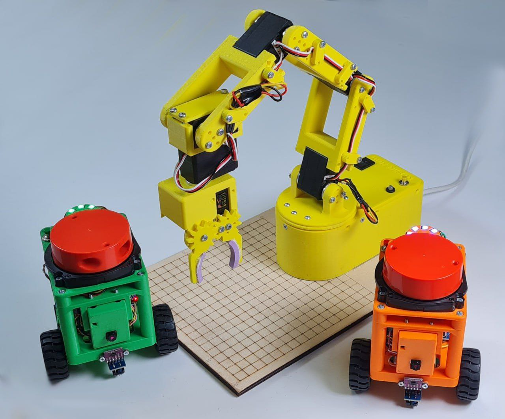

# PROM Robotics Course

Учебный курс по электронике и программированию на **Arduino/ESP** для учеников 12–15 лет. Практика «от простого к сложному», каждый модуль — самостоятельный мини‑проект с готовыми скетчами, заданиями и методическими материалами.

---

## Быстрый старт

1. **Клонируйте** репозиторий или скачайте ZIP: `Code → Download ZIP`.
2. Откройте нужный модуль (например, [`lesson02`](lesson02/)) и следуйте его `README.md`.
3. Работаете в **TinkerCad** или на реальной плате **Arduino**.
4. Работаете на **железе**? Убедитесь в корректной схеме подключения (картинки в `assets/`) и скорости Serial.
5. Всегда проверяйте, что в Arduino IDE выбрана верная **Board** и **Port**. А если вы используете Arduino Nano, то еще и правильный процессор

---

## Структура репозитория

```
lessonNN/                  # папка урока N (двузначный номер)
  assets/                  # изображения, схемы, диаграммы
  sketches/                # скетчи урока
    01_.../                # скетч 1 (папка)
      01_....ino
    02_.../                # скетч 2 (папка)
      02_....ino
    ...
  README.md                # методичка (цели, задания, контроль, ссылки на скетчи)
```

---

## Каталог уроков

Каждый урок — это готовая траектория:

* краткая теория,
* 3–4 скетча «с нарастанием сложности»,
* задания на доработку,
* контрольные вопросы

### Урок 01 — Основные понятия, светодиод, кнопка, `millis()`

* Документация: [`lesson01/README.md`](lesson01/README.md)
* Скетчи:
  * **V1** — мигание одним светодиодом (с `delay()`):  
    [`lesson01/sketches/01_blink_delay/01_blink_delay.ino`](lesson01/sketches/01_blink_delay/01_blink_delay.ino)
  * **V2** — кнопка: «нажал — горит, отпустил — погас» (`INPUT_PULLUP`):  
    [`lesson01/sketches/02_button_hold/02_button_hold.ino`](lesson01/sketches/02_button_hold/02_button_hold.ino)
  * **V3** — мигание без `delay()` на `millis()`:  
    [`lesson01/sketches/03_blink_millis/03_blink_millis.ino`](lesson01/sketches/03_blink_millis/03_blink_millis.ino)
  * **V4** — финал: три независимых мигания + кнопка (`INPUT_PULLUP`):  
    [`lesson01/sketches/04_multi_blink_button/04_multi_blink_button.ino`](lesson01/sketches/04_multi_blink_button/04_multi_blink_button.ino)


### Урок 02 — Кнопка, `millis()`, антидребезг и режимы

* Документация: [`lesson02/README.md`](lesson02/README.md)
* Скетчи:

  * **V1** — неблокирующая последовательность — [`lesson02/sketches/01_sequence/01_sequence.ino`](lesson02/sketches/01_sequence/01_sequence.ino)
  * **V2** — короткое/длинное нажатие — [`lesson02/sketches/02_long_short_press/02_long_short_press.ino`](lesson02/sketches/02_long_short_press/02_long_short_press.ino)
  * **V3** — режимы мигания — [`lesson02/sketches/03_modes/03_modes.ino`](lesson02/sketches/03_modes/03_modes.ino)
  * **V4** — «про»-уровень (залоченный OFF) — [`lesson02/sketches/04_modes_button_longpress/04_modes_button_longpress.ino`](lesson02/sketches/04_modes_button_longpress/04_modes_button_longpress.ino)


---