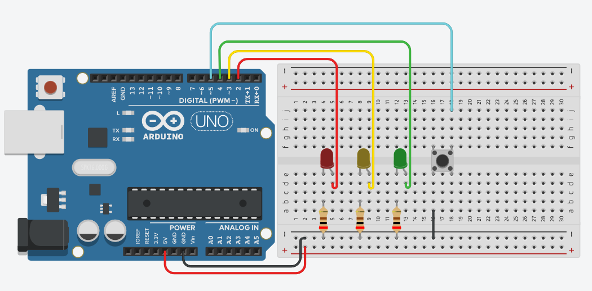

# Урок 1. Светодиоды, кнопка и `millis()` (без `delay()`)

Добро пожаловать в первый урок курса по промышленной робототехнике. Здесь вы соберёте простую установку на Arduino Uno с тремя светодиодами и кнопкой, научитесь использовать встроенную подтяжку `INPUT_PULLUP`, реализуете **антидребезг** и **асинхронную** логику мигания на базе таймера `millis()` — без остановок `delay()`.



---

## Цели урока
- Научиться мигать **несколькими** светодиодами одновременно без `delay()`.
- Понять, как работает `INPUT_PULLUP` и почему кнопку удобно подключать к **GND**.
- Сделать надёжную обработку кнопки (антидребезг) и простую **машину состояний**.
- Разобраться с подходом «проверяем, прошло ли время» (`millis() - t > interval`).

## Что соберём
- Красный (D2), жёлтый (D3), зелёный (D4) светодиоды (каждый через резистор 220–330 Ω) на макетной плате.
- Кнопка на D5 с внутренней подтяжкой `INPUT_PULLUP` (внешний резистор **не нужен**).
- Общий минус — шина GND.

## Необходимые компоненты
- Arduino Uno (или совместимая плата).
- Макетная плата  + набор проводов «папа–папа».
- 3 × светодиода (красный, жёлтый, зелёный).
- 3 × резистора 220–330 Ω.
- Тактовая кнопка.
- USB-кабель для прошивки.

## Схема и таблица соединений
Смотрите изображение выше (`scheme.png`). Ниже — текстовое соответствие:

| Назначение | Пин Arduino | Примечание |
|---|---|---|
| Красный светодиод | D2 | Через резистор на GND |
| Жёлтый светодиод | D3 | Через резистор на GND |
| Зелёный светодиод | D4 | Через резистор на GND |
| Кнопка | D5–GND | Режим `INPUT_PULLUP`, логика инвертирована |

> Полярность светодиода: длинная ножка — анод (+, к пину Arduino через резистор), короткая — катод (–, к GND).

## Теория
- **Без `delay()`**: `delay()` блокирует процессор и мешает параллельным задачам. Вместо этого храним время последнего переключения и проверяем `if (millis() - t > interval)` для каждой задачи отдельно.
- **`INPUT_PULLUP`**: включает внутренний подтягивающий резистор к VCC. Поэтому «не нажата» = `HIGH (1)`, «нажата» = `LOW (0)`. Удобно инвертировать чтение: `pressed = !digitalRead(pin)`.
- **Антидребезг**: механическая кнопка несколько миллисекунд «шумит». Мы игнорируем срабатывания, пока не пройдет небольшая пауза (например, 5–20 мс).
- **Машина состояний**: флаг `buttonPressed` защищает от многократных срабатываний, пока кнопка удерживается.
- **Типы таймеров**: в реальных проектах используйте `unsigned long` для сравнения с `millis()` (защита от переполнения).

## Пошаговая сборка
1. Соедините **GND** Arduino с «минусовой» шиной макетки.
2. Установите три светодиода и по резистору на каждый (220–330 Ω) последовательно к GND.
3. Подключите аноды светодиодов к D2, D3, D4.
4. Поставьте кнопку между D5 и GND (перемычки короткие).
5. Проверьте надёжность всех соединений.

## Код урока
Скетч расположен в папке [`millis_button/`](millis_button). 
```cpp
/*
================================================================================
Урок: Асинхронное мигание и антидребезг кнопки с INPUT_PULLUP
Проект: «Светофор без delay()»

ЦЕЛИ УРОКА
1) Научиться мигать несколькими светодиодами одновременно без delay() при помощи millis().
2) Понять, как работает встроенная подтяжка INPUT_PULLUP.
3) Реализовать надёжную реакцию на кнопку (антидребезг) и простую «машину состояний» на флагах.
4) Разобраться, что такое «асинхронная логика» и зачем хранить таймеры.

СХЕМА ПОДКЛЮЧЕНИЯ 
- Красный светодиод (через резистор 220–330Ω) к D2 → другой вывод светодиода в GND.
- Жёлтый светодиод (через резистор 220–330Ω) к D3 → GND.
- Зелёный светодиод (через резистор 220–330Ω) к D4 → GND.
- Кнопка к D5 и GND. Внешний резистор НЕ нужен: мы включим INPUT_PULLUP!
  (Это значит: когда кнопка НЕ нажата — на входе логическая 1; когда нажата — логический 0)


ИДЕИ
- Никаких delay() — они «замораживают» процессор и мешают делать несколько задач сразу.
- millis() возвращает число миллисекунд с момента старта; мы сравниваем «текущее время – время_старта > интервал».
- Для устойчивой кнопки нужен антидребезг (обычно 10–50 мс). Здесь задано 5 мс — это «минимально допустимо».
- Логика кнопки инвертирована: из-за INPUT_PULLUP «нажато» = 0, «отжато» = 1. Мы переворачиваем её оператором инверсии «!».

- Тип таймеров лучше делать unsigned long (классический вариант Arduino против переполнения).
  В коде используется long — для учебной простоты, но в реальном коде меняйте на unsigned long.
- Оператор «and» — это допустимый синоним «&&» в C++. Для индустрии чаще используют «&&».
- Комплексирование операторов digitalWrite(pin, !digitalRead(pin)) удобен для «переключения».
- Интервалы выбраны разные (100 мс, 235 мс), чтобы показать независимость таймеров.

ПРАКТИКА (сделайте после запуска)
1) Измените длительность жёлтого мигания на 500 мс — посмотрите, как меняется рисунок.
2) Сделайте, чтобы зелёный светодиод менял состояние только при отпускании кнопки (событие «release»).
3) Превратите блок с красным/жёлтым в функцию blink(pin, interval, timer).
4) Усложнение: длинное нажатие (>1 с) включает зелёный постоянно, короткое — переключает.

ВОПРОСЫ ДЛЯ САМОПРОВЕРКИ
- Почему delay() мешает мигать несколькими светодиодами одновременно?
- Чем хорош INPUT_PULLUP и почему кнопку подключаем к GND?
- Что такое «антидребезг» и для чего нужен флаг buttonPressed?
- Почему сравнивают «millis() - timer > interval», а не «millis() > timer + interval»?

================================================================================
*/

int greenPin  = 4;  // Пин зелёного светодиода 
int yellowPin = 3;  // Пин жёлтого светодиода
int redPin    = 2;  // Пин красного светодиода
int buttonPin = 5;  // Пин кнопки (кнопка между D5 и GND, включим INPUT_PULLUP)

// Таймеры для каждого независимого процесса мигания/дребезга.
long timerRed   = 0;
long timerYellow= 0;
long timerGreen = 0;

// Переменные для логики кнопки
int button = 0;          // Текущее состояние кнопки после инверсии (!digitalRead)
int buttonPressed = 0;   // Флаг «кнопка находится в нажатом состоянии» (машина состояний: 0→1→0)

/*
setup() — однократный вызов при старте.
- Выводы светодиодов — OUTPUT.
- Кнопка — INPUT_PULLUP (включает внутреннюю подтяжку к VCC → экономим резистор и места на макетке).
*/
void setup()
{
  pinMode(redPin,    OUTPUT);
  pinMode(yellowPin, OUTPUT);
  pinMode(greenPin,  OUTPUT);

  pinMode(buttonPin, INPUT_PULLUP); // НЕ нажата: HIGH (1). Нажата: LOW (0).
}

/*
loop() — главный цикл. В нём три независимых «задачи», каждая со своим таймером:
1) Красный мигает каждые ~100 мс.
2) Жёлтый мигает каждые ~235 мс.
3) Зелёный переключается при нажатии кнопки (с антидребезгом ~5 мс и флагом, чтобы не «дребезжало»).
*/
void loop() 
{
  // ────────────────────────────────────────────────────────────────────────────
  // 1) Асинхронное мигание КРАСНЫМ без delay()
  // Проверяем, прошло ли 100 мс с последнего переключения.
  if (millis() - timerRed > 100) {
    // Переключаем состояние вывода: если было 1 — станет 0, и наоборот.
    digitalWrite(redPin, !digitalRead(redPin));
    // Запоминаем «время последнего переключения»
    timerRed = millis();
  }

  // ────────────────────────────────────────────────────────────────────────────
  // 2) Асинхронное мигание ЖЁЛТЫМ без delay()
  if (millis() - timerYellow > 235) {
    digitalWrite(yellowPin, !digitalRead(yellowPin));
    timerYellow = millis();
  }

  // ────────────────────────────────────────────────────────────────────────────
  // 3) Обработка КНОПКИ с антидребезгом и флагом состояния
  // INPUT_PULLUP даёт «инвертированную» логику: НЕ нажата = 1 (HIGH), нажата = 0 (LOW).
  // Поэтому сразу инвертируем, чтобы button = 1 означало «нажата».
  button = !digitalRead(buttonPin);

  // Вариант машины состояний:
  // Состояние A: buttonPressed == 0 (кнопка в «отжатом» состоянии). 
  // При нажатии (button == 1) и выдержке антидребезга — переключаем зелёный и переходим в состояние B.
  if (millis() - timerGreen > 5 and button == 1 and buttonPressed == 0) {
    digitalWrite(greenPin, !digitalRead(greenPin)); // Однократное переключение при нажатии
    timerGreen = millis();  // Сбрасываем таймер антидребезга
    buttonPressed = 1;      // Фиксируем, что мы уже обработали «нажатое» состояние
  }

  // Состояние B: buttonPressed == 1 (кнопка «считается» нажатой).
  // Ждём отпускания (button == 0) с выдержкой антидребезга — возвращаемся в состояние A.
  if (millis() - timerGreen > 5 and button == 0 and buttonPressed == 1) {
    timerGreen = millis();  // Снова сброс таймера для стабильности
    buttonPressed = 0;      // Разрешаем обработку следующего нажатия
  }
}

/*
────────────────────────────────────────────────────────────────────────────────
💡 ИДЕИ ДЛЯ УЛУЧШЕНИЙ

1) Типы и константы:
   - Замените int/long на более точные типы:
       const uint8_t redPin = 2;
       unsigned long timerRed = 0;
   - Интервалы сделайте константами: const unsigned long RED_INTERVAL = 100;

2) Универсальная функция мигания:
   Создайте функцию:
       void blink(uint8_t pin, unsigned long &timer, unsigned long interval) { ... }
   и используйте её для красного/жёлтого.

3) Больше состояний кнопки:
   Реализуйте короткое/длинное нажатие:
   - Если удержание > 1000 мс — зелёный включается постоянно.
   - Если короткое — просто переключение.

4) Стиль C++:
   - Вместо «and» используйте «&&» — так принято в большинстве команд/гайдлайнов.

УДАЧИ! И помните: отсутствие delay() — ваш главный инструмент для «параллельных» задач на микроконтроллере.
*/

```

### Как прошить
1. Откройте `millis_button/millis_button.ino` в Arduino IDE.
2. Выберите плату **Arduino Uno** и соответствующий COM-порт.
3. Нажмите **Загрузить**.

## Что должно получиться
- Красный мигает примерно раз в 100 мс, жёлтый — раз в ~235 мс.
- Зелёный **переключается один раз** на каждое нажатие (даже если удерживать), благодаря антидребезгу и флагу.

## Частые ошибки и как их найти
- Светодиод не горит: проверьте **полярность** и резистор, нет ли обрыва GND.
- Кнопка «дребезжит»: убедитесь, что используете `INPUT_PULLUP` и есть задержка на антидребезг.
- Всё «замирает»: проверьте, нет ли где-либо `delay()` — его в этом уроке быть не должно.
- Перепутаны пины: сверяйтесь с таблицей и схемой выше.

## Практика
- Увеличьте интервал мигания жёлтого до `500` мс и посмотрите на рисунок.
- Сделайте, чтобы зелёный переключался **по отпусканию** (событие *release*).
- Вынесите мигание красного/жёлтого в функцию `blink(pin, timer, interval)`.
- Реализуйте короткое (< 1000 мс) и длинное (≥ 1000 мс) нажатия — разные действия.

## Вопросы для самопроверки
1. Почему `delay()` мешает параллельной работе нескольких задач?
2. Чем полезен `INPUT_PULLUP` и почему кнопку подключаем к GND?
3. Что такое «антидребезг»? Зачем флаг `buttonPressed`?
4. Почему сравнивают `millis() - t > interval`, а не `millis() > t + interval`?

---

### Структура папок
```
lesson-01/
├── README.md
├── scheme.png
└── millis_button/
    └── millis_button.ino
```

