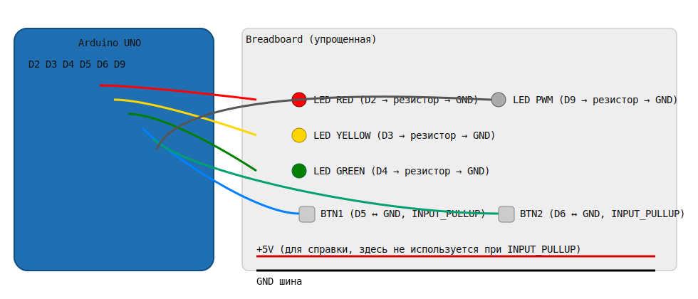

# Урок 2. Кнопка, неблокирующий код, антидребезг, последовательности и ШИМ

В этом уроке мы углубляемся в **C++ на Arduino** и строим более «промышленную» логику: реагируем на **короткие** и **длинные** нажатия, **не блокируем** процессор, управляем **последовательностями** и знакомимся с **ШИМ** (PWM). По пути используем **Serial** для отладки.




---

## Цели
- Научиться писать **неблокирующий** код на базе `millis()` (без `delay()`).
- Реализовать **антидребезг** кнопки через «переменную-флаг» и детекцию фронтов.
- Обработать **два типа нажатий**: короткое (реакция *сразу*) и длинное (≥ 3 c, срабатывание **по таймеру**, не дожидаясь отпускания).
- Построить **последовательность** переключения светодиодов с использованием **счётчиков**.
- Познакомиться с **Serial** как инструментом отладки.
- Освоить **ШИМ** и понять, что **не все пины** UNO поддерживают PWM.

## Что собираем
- **Базовая схема (1 кнопка)** — как в Уроке 1: D2, D3, D4 → светодиоды через резисторы, **D5 ↔ GND** (кнопка, `INPUT_PULLUP`).
- **Схема с 2 кнопками** — добавляем вторую кнопку на **D6 ↔ GND**. Она понадобится для опыта с PWM.

> Напоминание: при `INPUT_PULLUP` логика инвертирована: *не нажато* = `HIGH`, *нажато* = `LOW`.

## Скetchи урока
Все примеры находятся в папке [`sketches/`](sketches). Открывайте нужную папку и загружайте `.ino` в плату.

1. **`01_modes_button_longpress/modes_button_longpress.ino`**  
   - Короткое нажатие (сразу по нажатию) циклически переключает режимы: **FAST → SLOW → ALL → FAST**.  
   - Длинное нажатие **≥ 3 c** мгновенно переводит систему в **OFF** (всё выключено).  
   - **Следующее любое нажатие** возвращает последний рабочий режим.  
   - Всё — неблокирующее, на `millis()`, с антидребезгом.

2. **`02_sequence_counters/sequence_counters.ino`**  
   - Демонстрация «**счётчиков**»: шаги, циклы, смена скорости после N полных проходов.  
   - Чёткое разделение на «шаг последовательности» и «счётчик циклов».

3. **`03_pwm_fade_two_buttons/pwm_fade_two_buttons.ino`**  
   - **ШИМ-нагрузка** на пине **D9** (поддерживает PWM).  
   - Две кнопки (**D5** — больше яркость, **D6** — меньше). Короткое и удержание (повтор) работают неблокирующе.  
   - Используется `analogWrite()` и вывод отладочных значений в `Serial`.

4. **`04_variant_switch_case/variant_switch_case.ino`** (шаблон)  
   - Вариант с `switch-case` и структурой для хранения таймеров — база для самостоятельных экспериментов.

## Как понять и повторить логику
### 1) Неблокирующий подход
- Каждую «задачу» (мигание, чтение кнопки, ШИМ) обслуживаем **по чуть-чуть** в `loop()`.
- Время проверяем так: `if (millis() - t >= interval) { ... }` — это безопаснее при переполнении `millis()`.

### 2) Антидребезг и флаги
- Храним **стабильное** состояние кнопки и время последнего изменения. Пропускаем шум < 10–20 мс.
- Отслеживаем **фронты**: `HIGH → LOW` (*нажатие*) и `LOW → HIGH` (*отпускание*).
- Для длинного нажатия запускаем «таймер удержания» и, когда прошло ≥ 3000 мс, **сразу** выполняем действие (OFF).

### 3) Последовательности и счётчики
- «Шаг» = индекс текущего светодиода (`0..2`).  
- «Цикл» = несколько полных проходов по шагам. После N циклов можно менять скорость, режим и т.п.

### 4) Serial — ваш друг
- Откройте **Serial Monitor** (115200 бод) и печатайте ключевые события: смены режима, таймеры, уровни PWM.  
- Примеры:  
  ```cpp
  Serial.begin(115200);
  Serial.print("Mode => "); Serial.println(modeName(currentMode));
  Serial.print("PWM="); Serial.println(level);
  ```

### 5) PWM (ШИМ)
- На UNO аппаратный PWM есть только на пинах **3, 5, 6, 9, 10, 11**. На других `analogWrite()` **не** даст ШИМ.  
- Суть: быстро включаем/выключаем выход с разной **скважностью** → средняя мощность меняется, яркость — тоже.
- В опыте с двумя кнопками меняем уровень **0..255**. Проверьте визуально и по `Serial`.

## Пошаговая проверка (чек‑лист)
1. Загрузите скетч `01_modes_button_longpress`. Сразу по нажатию — меняется режим. Удерживайте 3 сек — всё гаснет. Любое следующее нажатие — возврат к работе.
2. Загрузите `02_sequence_counters` и наблюдайте, как после нескольких циклов меняется скорость. Смотрите логи в `Serial`.
3. Соберите схему с двумя кнопками и загрузите `03_pwm_fade_two_buttons`. Меняйте яркость кнопками, удерживайте для «автоповтора».

## Частые ошибки
- **Нет реакции на кнопку**: проверьте, что используете `INPUT_PULLUP` и кнопка идёт на **GND**.
- **Всё «тормозит»**: где‑то затесался `delay()` — уберите его.
- **`analogWrite()` «не работает»**: вы не на PWM‑пине (используйте 3, 5, 6, 9, 10 или 11 на UNO).
- **Дребезг**: увеличьте `DEBOUNCE` до 20–30 мс, проверьте длину проводов.

## Задания (практика)
- Добавьте **режим «бегущий огонь»** в `modes_button_longpress`.
- Сделайте **двойное нажатие**: быстрый переход сразу в `ALL`.
- В `pwm_fade_two_buttons` добавьте **яркостные пресеты** по долгому удержанию (например, 25/50/100%).  
- Придумайте собственный **протокол логов** в `Serial`: краткие теги, счётчики, время.

## Вопросы для самопроверки
1. Почему сравнение `millis() - t >= interval` устойчиво к переполнению?
2. Что такое «фронт» сигнала и как его использовать для событий «нажатие/отпускание»?
3. В чём разница между **шагом** и **циклом** в последовательности?
4. Почему не все пины UNO поддерживают `analogWrite()` и что именно делает ШИМ?

---

### Структура урока
```
lesson-02/
├── README.md
├── assets/
│   ├── scheme-1btn.png
│   └── scheme-2btn.svg
└── sketches/
    ├── 01_modes_button_longpress/
    │   └── modes_button_longpress.ino
    ├── 02_sequence_counters/
    │   └── sequence_counters.ino
    ├── 03_pwm_fade_two_buttons/
    │   └── pwm_fade_two_buttons.ino
    └── 04_variant_switch_case/
        └── variant_switch_case.ino
```
