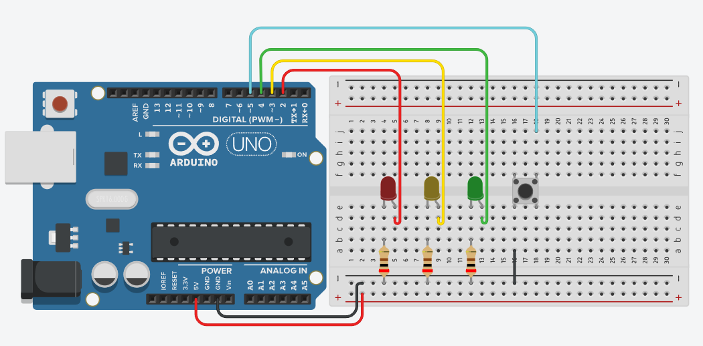
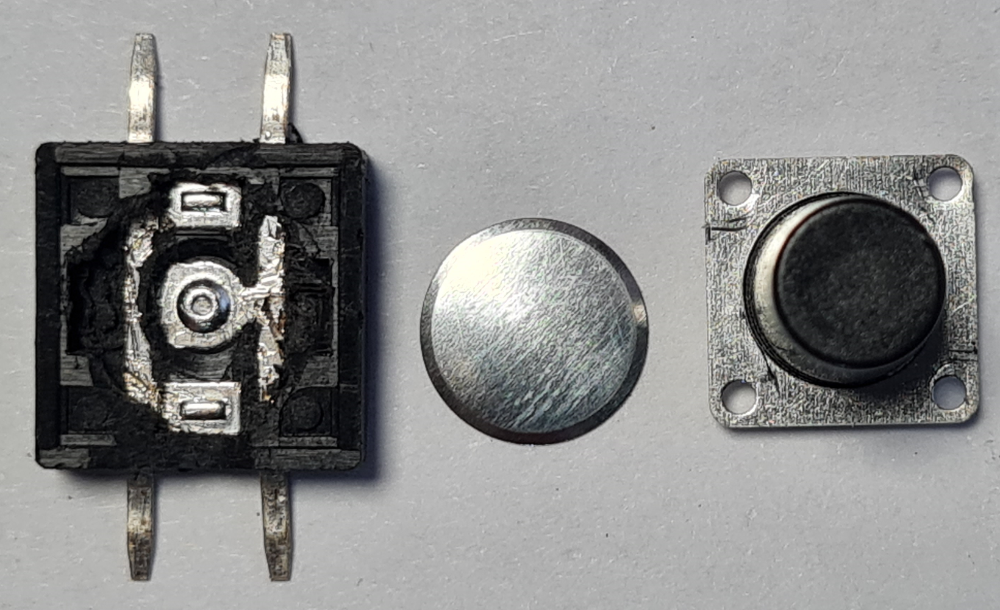

# Урок 2. Кнопка, неблокирующий код, антидребезг и режимы

В этом уроке шаг за шагом строим «промышленную» логику на **Arduino**:

* неблокирующие последовательности на базе `millis()` (без `delay()`),
* **антидребезг** и детекция **короткого/длинного** нажатия кнопки (режим `INPUT_PULLUP`),
* переключение **режимов мигания** и чистая архитектура с функциями.




---

## Ссылки на скетчи:

* **V1** — неблокирующая последовательность: [`lesson02\sketches\01_sequence\01_sequence.ino`](lesson02\sketches\01_sequence\01_sequence.ino)
* **V2** — короткое/длинное нажатие: [`lesson02\sketches\02_long_short_press\02_long_short_press.ino`](lesson02\sketches\02_long_short_press\02_long_short_press.ino)
* **V3** — режимы мигания: [`lesson02\sketches\03_modes\03_modes.ino`](lesson02\sketches\03_modes\03_modes.ino)
* **V4** — «про»-уровень (залоченный OFF, мгновенная реакция): [`lesson02\sketches\04_modes_button_longpress\04_modes_button_longpress.ino`](lesson02\sketches\04_modes_button_longpress\04_modes_button_longpress.ino)

---

## Оборудование и подключение

* **Плата:** Arduino
* **Светодиоды:** 3 шт (красный D2, жёлтый D3, зелёный D4)
* **Резисторы** к светодиодам: 220–330 Ω к GND
* **Кнопка:** на пин D5 и **GND**, режим `INPUT_PULLUP` (внутренняя подтяжка к +5 В)

> При `INPUT_PULLUP`: *не нажато* = `HIGH (1)`, *нажато* = `LOW (0)`.
> У 4-контактной кнопки пары выводов соединены **вертикально**. Подключаайте провода к кнопке к контактам "по диагонали".



Подробнее про подключение кнопок:
https://stepik.org/lesson/651743/step/1?unit=648463

---

## Быстрый чек-лист перед стартом

* В Arduino IDE выбрана верная **Board** (UNO) и **Port**. А если вы используете Nano, то еще и правильный процессор

---

# V1 — Неблокирующая последовательность без `delay()`

**Идея:** циклически включать один из трёх светодиодов через равные интервалы, используя `millis()` и массив пинов.

Код:

```cpp
// V1: последовательность без delay()
byte LEDS[3] = {2, 3, 4};          // пины светодиодов
unsigned long timer = 0;           // «таймер шага»
unsigned long STEP = 200;          // интервал в мс
byte idx = 0;                      // текущий светодиод 0..2

void setup() {
  for (byte i = 0; i < 3; i++) {
    pinMode(LEDS[i], OUTPUT);
    digitalWrite(LEDS[i], LOW);
  }
  Serial.begin(115200);
}

void loop() {
  if (millis() - timer >= STEP) {  // пришло ли время?
    timer = millis();
    for (byte i = 0; i < 3; i++) digitalWrite(LEDS[i], LOW); // гасим все
    digitalWrite(LEDS[idx], HIGH);                            // зажигаем один
    idx = (idx + 1) % 3;                                      // следующий 0→1→2→0→…
  }
}
```

### Объяснение

* `millis()` возвращает время от старта в миллисекундах. Сравнивая с `timer`, мы избегаем блокирующих `delay()` и код остаётся «живым».
* Массив `LEDS[]` избавляет от дублирования кода — можно изменить порядок/количество светодиодов за одну строку.

### Задания (V1)

1. **Измени скорость**: сделай `STEP = 80` и `STEP = 600`. Что меняется визуально? Где «комфортная» граница?
2. **Добавь 4-й светодиод** на D6, расширь массив и логику. Что нужно поменять?
3. **Обратная последовательность:** попробуй идти 2→1→0→2→… (подсказка: счётчик вниз и модульная арифметика или флаг направления).

---

# V2 — Кнопка: короткое/длинное нажатие и антидребезг

**Идея:** детектируем нажатие/отпускание, фильтруем дребезг, различаем **короткое** (переключение ON/OFF) и **длинное** (включить мигание всех).

Код:

```cpp
const byte LEDS[3] = {2,3,4};
const byte BTN = 5;                      // кнопка ↔ GND, INPUT_PULLUP

enum Mode {OFF=0, ON=1, BLINK=2};       // три состояния
Mode mode = OFF;

const unsigned long DEBOUNCE=15, LONG_MS=3000, BLINK_STEP=250;
unsigned long btnLastChange=0, pressStart=0, lastBlink=0;
bool btnStable=HIGH, btnPrevStable=HIGH, longFired=false; // стабильное и предыдущее состояние

void setAll(byte s){ for(byte i=0;i<3;i++) digitalWrite(LEDS[i], s); }

void setup(){
  for(byte i=0;i<3;i++){ pinMode(LEDS[i],OUTPUT); digitalWrite(LEDS[i],LOW); }
  pinMode(BTN, INPUT_PULLUP);
  Serial.begin(115200);
}

void loop(){
  unsigned long now=millis();
  bool raw=digitalRead(BTN);                                  // HIGH=не нажато, LOW=нажато
  if(raw!=btnStable && (now-btnLastChange)>DEBOUNCE){         // антидребезг
    btnPrevStable=btnStable; btnStable=raw; btnLastChange=now;

    if(btnPrevStable==HIGH && btnStable==LOW){                 // нажали
      pressStart=now; longFired=false;
    }
    if(btnPrevStable==LOW && btnStable==HIGH){                 // отпустили
      if(!longFired){                                         // короткое
        mode = (mode==OFF)? ON : OFF;
      }
    }
  }

  if(btnStable==LOW && !longFired && (now-pressStart)>=LONG_MS){ // держим долго
    longFired=true; mode=BLINK;                                 // длинное
  }

  if(mode==OFF){ setAll(LOW); }
  else if(mode==ON){ setAll(HIGH); }
  else {                                                       // BLINK
    if(now-lastBlink>=BLINK_STEP){ lastBlink=now; static bool on=false; on=!on; setAll(on?HIGH:LOW); }
  }
}
```

### Объяснение

* Событие **короткого** клика срабатывает по **отпусканию**: это упрощает различение с длительным удержанием.
* Флаг `longFired` не даёт короткому «догнаться» за длинным.

### Задания (V2)

1. Сделай короткое действие **по нажатию**, а не по отпусканию. Что меняется? Где нужен дополнительный флаг?
2. Поменяй длительность длинного нажатия на **1500 мс** и на **5000 мс**. Удобно ли?
3. Пусть BLINK мигает **только средним** светодиодом. Как изменить `setAll()`/логику?

---

# V3 — Переключение режимов + функции (TinkerCad‑friendly)

**Идея:** масштабируем архитектуру: режимы **FAST → SLOW → ALL → FAST**, длинное удержание переводит в **OFF**. Добавляем функции `switchToMode()`, `setAll()`, аккуратно ведём индексы и тайминги.

Код:

```cpp
#define LED_R 2
#define LED_Y 3
#define LED_G 4
#define BTN   5

uint8_t LEDS[3] = { LED_R, LED_Y, LED_G };

#define MODE_FAST 0
#define MODE_SLOW 1
#define MODE_ALL  2
#define MODE_OFF  3

uint8_t current = MODE_FAST;

const unsigned long FAST_STEP = 150;   // чуть медленнее для TinkerCad
const unsigned long SLOW_STEP = 600;
const unsigned long ALL_STEP  = 400;

unsigned long lastStep = 0, btnLast = 0, pressStart = 0;
uint8_t idx = 0;

bool btnStable = HIGH, btnPrev = HIGH, longFired = false;
const unsigned long DEBOUNCE = 30;     // ↑ дебаунс
const unsigned long LONG_MS  = 1500;   // ↓ длительное удержание

void setAll(uint8_t s){ for (uint8_t i=0;i<3;i++) digitalWrite(LEDS[i], s); }

const char* nameOf(uint8_t m){
  switch (m){
    case MODE_FAST: return "FAST";
    case MODE_SLOW: return "SLOW";
    case MODE_ALL:  return "ALL";
    default:        return "OFF";
  }
}

void switchToMode(uint8_t m){
  current = m; lastStep = millis(); idx = 0;
  if (current == MODE_OFF) setAll(LOW);
  Serial.print("Mode => "); Serial.println(nameOf(current));
}

void handleButton(){
  unsigned long now = millis();
  bool raw = digitalRead(BTN);                 // INPUT_PULLUP
  if (raw != btnStable && (now - btnLast) > DEBOUNCE){
    btnPrev = btnStable; btnStable = raw; btnLast = now;
    if (btnPrev == HIGH && btnStable == LOW){  // press
      pressStart = now; longFired = false;
    }
    if (btnPrev == LOW && btnStable == HIGH){  // release
      if (!longFired){                          // короткое → следующий режим
        if      (current == MODE_FAST) switchToMode(MODE_SLOW);
        else if (current == MODE_SLOW) switchToMode(MODE_ALL);
        else if (current == MODE_ALL)  switchToMode(MODE_FAST);
        else if (current == MODE_OFF)  switchToMode(MODE_FAST);
      }
    }
  }
  if (btnStable == LOW && !longFired && (now - pressStart) >= LONG_MS){ // long
    longFired = true; switchToMode(MODE_OFF);
  }
}

void doBlink(){
  if (current == MODE_OFF) return;
  unsigned long now = millis();
  if (current == MODE_FAST || current == MODE_SLOW){
    unsigned long step = (current == MODE_FAST) ? FAST_STEP : SLOW_STEP;
    if (now - lastStep >= step){
      lastStep = now; setAll(LOW); digitalWrite(LEDS[idx], HIGH); idx = (idx + 1) % 3;
    }
  } else if (current == MODE_ALL){
    if (now - lastStep >= ALL_STEP){
      lastStep = now; static bool on = false; on = !on; setAll(on ? HIGH : LOW);
    }
  }
}

void setup(){
  Serial.begin(9600);                         // под симулятор
  for (uint8_t i=0;i<3;i++){ pinMode(LEDS[i], OUTPUT); digitalWrite(LEDS[i], LOW); }
  pinMode(BTN, INPUT_PULLUP);
  switchToMode(current);
  setAll(HIGH); delay(100); setAll(LOW);      // короткий самотест
}

void loop(){ handleButton(); doBlink(); }
```


### Задания (V3)

1. Добавь **режим «Knight Rider»** (бегущий огонь туда‑сюда). Подсказка: хранить направление `dir=+1/-1`, менять на границах 0/2.
2. Сделай, чтобы **длинное удержание** из любого режима выключало и **сохраняло последний рабочий** режим, чтобы потом к нему вернуться (смотри идею в V4).
3. Добавь **режим «один медленный, два быстрых»** (комбинированные тайминги). Где лучше хранить набор таймингов?

---

# V4 — «Про»-уровень: мгновенная реакция, «залоченный OFF» и возврат к предыдущему

**Идея:** короткое **обрабатываем сразу при нажатии**, длинное срабатывает **во время удержания**, и режим **OFF залочен** до следующего нажатия; при выходе — возврат к **последнему рабочему** режиму.

Код:

```cpp
/* Пины и режимы */
const byte LED_R = 2, LED_Y = 3, LED_G = 4, BTN1 = 5;
const byte LEDS[3] = { LED_R, LED_Y, LED_G };
const byte MODE_FAST = 0, MODE_SLOW = 1, MODE_ALL = 2, MODE_OFF = 3;
byte currentMode = MODE_FAST, lastWorkMode = MODE_FAST;

/* Тайминги */
unsigned long lastStepMs = 0;                    // таймер шага
const unsigned long FAST_STEP=100, SLOW_STEP=500, ALL_STEP=250;
byte idx = 0;                                     // индекс 0..2

/* Кнопка и дребезг */
bool btnStable=HIGH, btnPrevStable=HIGH;          // стабильные состояния
unsigned long btnLastChangeMs=0;                  // таймер дребезга
const unsigned long DEBOUNCE=15;                  // мс
bool isLockedOff=false;                            // флаг «залоченного OFF»
unsigned long pressStartMs=0;                      // момент нажатия
bool longTriggered=false;                          // сработало ли длинное

void setAll(byte s){ for(byte i=0;i<3;i++) digitalWrite(LEDS[i], s); }
const char* modeName(byte m){
  if(m==MODE_FAST) return "FAST (seq)"; if(m==MODE_SLOW) return "SLOW (seq)";
  if(m==MODE_ALL) return "ALL (sync)"; return "OFF";
}

void switchToMode(byte m){
  if(m!=MODE_OFF) lastWorkMode=m;                 // запомним рабочий режим
  currentMode=m; lastStepMs=millis(); idx=0;
  if(currentMode==MODE_OFF) setAll(LOW);
  Serial.print("Mode => "); Serial.println(modeName(currentMode));
}

void handleButton(){
  bool raw=digitalRead(BTN1); unsigned long now=millis();
  if(raw!=btnStable && (now-btnLastChangeMs)>DEBOUNCE){      // фронты с антидребезгом
    btnPrevStable=btnStable; btnStable=raw; btnLastChangeMs=now;
    if(btnPrevStable==HIGH && btnStable==LOW){               // нажали → короткое СРАЗУ
      pressStartMs=now; longTriggered=false;
      if(!isLockedOff){                                      // обычная работа
        if(currentMode==MODE_FAST) switchToMode(MODE_SLOW);
        else if(currentMode==MODE_SLOW) switchToMode(MODE_ALL);
        else if(currentMode==MODE_ALL) switchToMode(MODE_FAST);
        else if(currentMode==MODE_OFF) switchToMode(lastWorkMode);
      } else {                                               // выходим из LOCK OFF
        isLockedOff=false; switchToMode(lastWorkMode);
      }
    }
  }
  if(btnStable==LOW){                                        // удерживаем
    unsigned long held=now-pressStartMs;
    if(!longTriggered && held>=3000){                        // длинное ≥3с
      longTriggered=true; isLockedOff=true; switchToMode(MODE_OFF);
      Serial.println("Long press >=3s → OFF (locked)");
    }
  }
}

void doBlinkLogic(){
  if(currentMode==MODE_OFF) return;
  unsigned long now=millis();
  if(currentMode==MODE_FAST || currentMode==MODE_SLOW){
    unsigned long step=(currentMode==MODE_FAST)?FAST_STEP:SLOW_STEP;
    if(now-lastStepMs>=step){ lastStepMs=now; setAll(LOW); digitalWrite(LEDS[idx],HIGH); idx=(idx+1)%3; }
  } else if(currentMode==MODE_ALL){
    if(now-lastStepMs>=ALL_STEP){ lastStepMs=now; static bool on=false; on=!on; setAll(on?HIGH:LOW); }
  }
}

void setup(){
  Serial.begin(115200);
  pinMode(LED_R,OUTPUT); pinMode(LED_Y,OUTPUT); pinMode(LED_G,OUTPUT);
  pinMode(BTN1, INPUT_PULLUP); setAll(LOW); switchToMode(currentMode);
}

void loop(){ handleButton(); doBlinkLogic(); }
```

### Чем V4 отличается от V3

* Реакция на **короткое — сразу при нажатии**, а не при отпускании.
* Появился флаг `isLockedOff`: после длинного удержания OFF «залочен» до следующего клика.
* Хранится `lastWorkMode` для корректного возврата из OFF.

### Задания (V4)

1. Измени порядок циклических режимов на **FAST → ALL → SLOW → FAST**. Где менять?
2. Сделай **двойной клик**: два быстрых нажатия подряд (≤ 300 мс) включают ALL, иначе — обычная логика. Подсказка: второй таймер и счётчик кликов.
3. Добавь **индикацию режима** через короткую вспышку всех светодиодов при переключении. Как встроить, не ломая неблокирующую архитектуру?

---

---

## Контрольные вопросы

1. Почему `delay()` мешает обрабатывать кнопку и чем лучше `millis()`?
2. Что такое «антидребезг» и зачем сравнивать **предыдущее** и **текущее** состояние кнопки?
3. В `INPUT_PULLUP` значение пина при не нажатой кнопке — какое и почему?
4. Чем отличаются режимы `ALL` и `FAST/SLOW` по логике мигания?
5. Где и зачем хранится `lastWorkMode`?
6. Почему короткое действие удобнее делать по **отпусканию** (V2)? Когда лучше **по нажатию** (V4)?
7. Как добавить четвёртый светодиод, чтобы не переписывать много кода?
8. Как реализовать «бегущий огонь туда‑сюда»?
9. Как корректно подобрать `DEBOUNCE` и `LONG_MS` под реальное железо и под симулятор?
10. Какие плюсы у выделения функций `switchToMode()` и `doBlink()`?


---

## Приложение А — Мини‑шаблоны (часто пригодятся)

**Неблокирующий шаг по таймеру:**

```cpp
unsigned long t=0; const unsigned long STEP=200;
if (millis()-t >= STEP) { t = millis(); /* действие */ }
```

**Антидребезг на фронты:**

```cpp
bool stable=HIGH, prev=HIGH; unsigned long last=0; const unsigned long DEBOUNCE=15;
bool raw=digitalRead(BTN);
if (raw!=stable && (millis()-last)>DEBOUNCE) { prev=stable; stable=raw; last=millis(); /* обработка фронтов */ }
```

**Перебор массива пинов:**

```cpp
for (byte i=0;i<N;i++) digitalWrite(PINS[i], state);
```


